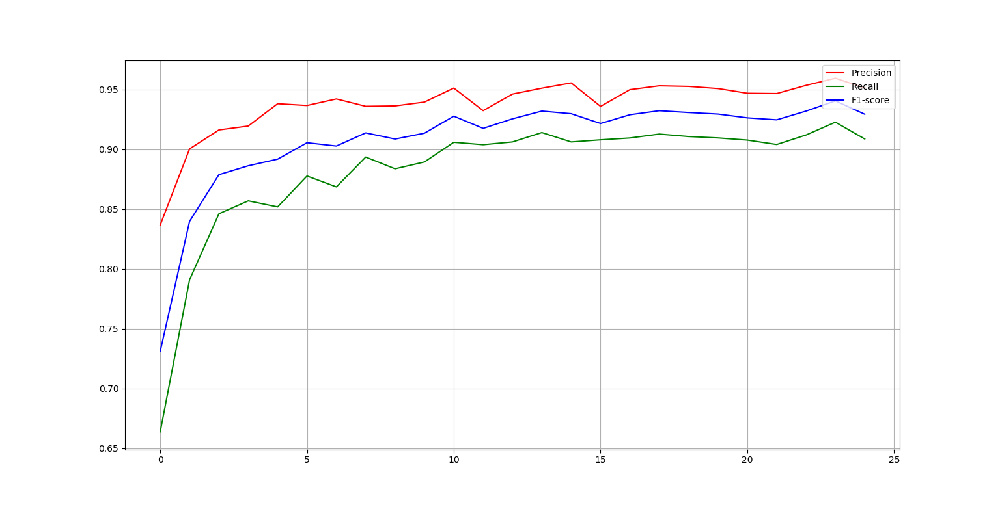

# CRF-bi-LSTM-sequence-tagging-Chinese-characters-
&emsp;&emsp;We use Python3.6+tensorflow1.12.0 to coding the bi-LSTM+CRF network structure and realizing the sequence tagging for chinese characters.

&emsp;&emsp;(1)Raw data preprocessing. Calling ` ` `vocab_build()` ` ` function to convert the data of .txt format to .pkl format. And initilazing the word vectors.(We set the dinmension of vectors is 300)

&emsp;&emsp;(2)Designing the network structure and hyper-parameters, calling ` ` `main.py` ` ` train and test model.

- batch_size=64;
- epoch=25;
- learning_rate=0.001;
- dropout=0.5;
- gradient_clipping=5.0;
- LSTM_num(forward)=300;
- LSTM_num(backward)=300；
- optimizer=Adam;
- ...

&emsp;&emsp; After 25 epochs, the precision, recall, F1 values of test set as shoun below.

 
Fig. precision, recall, F1 values

- precision=0.951266;
- recall=0.908613;
- f1=0.929270.
(After 25 iterations)

&emsp;&emsp;If you want to know more about the LSTM+CRF model, please to read [sequence labelling.md](https://github.com/PrideLee/CRF-bi-LSTM-sequence-tagging-Chinese-characters-/blob/master/introduction/sequence%20labelling.md) or [click here](https://www.zhihu.com/people/peterlee-19-97/posts).
