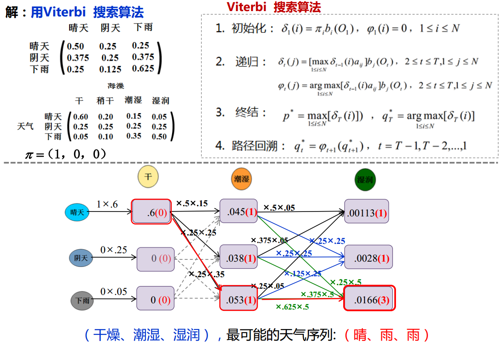

# Sequence tagging(Bi-LSTM+CRF)

## Introduction

&emsp;&emsp;序列标注问题(sequence labeling, also named as tagging)可以看作许多自然语言处理问题的前驱，如情感分析，信息检索、推荐和过滤等等。同时在自然语言处理中，许多的任务可以转化为“将输入的语言序列转化为标注序列”来解决问题，因此序列标注是自然语言处理中的重要研究内容之一。

&emsp;&emsp;在解决序列标注等问题前，我们通常首先要完成分词（word segmentation）操作。分词是词法分析的基础，对于英文由于其每个单词间天然会有空格符隔开，因此其分词相对容易（有时空格符这个强线索并不总是有效，如对于New York这个词我们希望其为一个词，因此这其实又涉及到序列标记中的命名实体识别问题）。然而对于中文字串的分词问题则相对比较麻烦，汉语分词任务的目标是将输入的句子从汉字序列切分为词序列，分词是汉语处理的重要
基础。经过三十多年的发展，大规模人工标注数据的产生和基于人工标注数据的统计方法取代了基于词表和规则的方法，使得分词准确率取得了显著提升，分词模型也变得更加简单有效。汉语分词的主要方法包括：基于词典的最大匹配分词法（刘源、梁南，1986）；全切分路径选择法（张华平、刘群，2002）、（Andrw,2006）；基于字序列标注的方法（Nianwen Xue et al.，2002）；基于转移的分词方法(Zhang and Clark, 2007)等。目前随着深度学习浪潮的涌现，许多基于深度学习的分词方法也相继被提出。对于分词问题目前主要面临的挑战包括：分词歧义消解、未登录词识别、错别字、谐音字规范化、分词粒度问题等。（有关分词的具体介绍可以参看我的另一篇笔记）

&emsp;&emsp;序列标记问题主要包括词性标注(POS tagging)、语义角色标注、信息抽取等。

 
图1. 序列标注问题

- 词性标注（POS）

&emsp;&emsp;给定一个切好词的句子，词性标注的目的是为每一个词赋予一个类别，这个类别称为词性标记（part-of-speech tag），比如，名词（noun）、动词（verb）、形容词（adjective）等。词性标注是一个非常典型的序列标注问题。

 
图2. 词性标注

- 信息抽取（IE）

&emsp;&emsp;信息抽取系统处理各种非结构化/半结构化的文本输入（如新闻网页、 商品页面、 微博、
论坛页面等），使用多种技术（如规则方法、 统计方法、知识挖掘方法）， 提取各种指定的结
构化信息（如实体、关系、 商品记录、 列表、 属性等）， 并将这些信息在不同的层面进行集
成（知识去重、知识链接、知识系统构建等）。 根据提取的信息类别， 目前信息抽取的核心
研究内容可以划分为命名实体识别(Named Entity Recognition, NER)、关系抽取(Relation
Extraction)、事件抽取和信息集成（Information Integration）。

（1）命名实体识别（NER）

&emsp;&emsp;命名实体识别的目的是识别文本中指定类别的实体，主要包括人名、地名、机构名、专有名词等的任务。例如，识别“2016年6月20日，骑士队在奥克兰击败勇士队获得NBA冠军”这句中的地名（奥克兰）、时间（2016年6 月20日）、球队（骑士队、勇士队）和机构（NBA）。命名实体识别系统通常包含两个部分：实体边界识别和实体分类，其中实体边界识别判断一个字符串是否是一个实体，而实体分类将识别出的实体划分到预先给定的不同类别中去。命名实体识别是一项极具实用价值的技术，目前中英文上通用命名实体识别（人名、地名、机构名）的F1值都能达到90%以上。命名实体识别的主要难点在于表达不规律、且缺乏训练语料的开放域命名实体类别（如电影、歌曲名）等。

 
图3. 人名识别

 
图4. 组织机构名识别

（2）关系抽取

&emsp;&emsp;关系抽取指的是检测和识别文本中实体之间的语义关系，并将表示同一语义关系的提及（mention）链接起来的任务。关系抽取的输出通常是一个三元组（实体1，关系类别，实体2），表示实体1和实体2之间存在特定类别的语义关系。例如， 句子“北京是中国的首都、政治中心和文化中心” 中表述的关系可以表示为（中国，首都，北京），（中国，政治中心，北京）和（中国，文化中心，北京）。语义关系类别可以预先给定（如 ACE评测中的七大类关系），也可以按需自动发现（开放域信息抽取）。关系抽取通常包含两个核心模块：关系检测和关系分类，其中关系检测判断两个实体之间是否存在语义关系，而关系分类将存在语义关系的实体对划分到预先指定的类别中。在某些场景和任务下，关系抽取系统也可能包含关系发现模块， 其主要目的是发现实体和实体之间存在的语义关系类别。例如，发现人物和公司之间存在雇员、CEO、CTO、创始人、董事长等关系类别。

（3）事件抽取

&emsp;&emsp;事件抽取指的是从非结构化文本中抽取事件信息，并将其以结构化形式呈现出来的任务。 例如，从“毛泽东 1893 年出生于湖南湘潭” 这句话中抽取事件{类型：出生，人物：毛泽东， 时间：1893年，出生地：湖南湘潭}。事件抽取任务通常包含事件类型识别和事件元素填充两个子任务。事件类型识别判断一句话是否表达了特定类型的事件。事件类型决定了事件表示的模板，不同类型的事件具有不同的模板。例如出生事件的模板是{人物，时间，出生地}，而恐怖袭击事件的模板是{地点，时间，袭击者，受害者，受伤人数,…}。事件元素指组成事件的关键元素，事件元素识别指的是根据所属的事件模板，抽取相应的元素，并为其标上正确元素标签的任务。

（4）信息集成

&emsp;&emsp;实体、关系和事件分别表示了单篇文本中不同粒度的信息。在很多应用中，需要将来自不同数据源、不同文本的信息综合起来进行决策，这就需要研究信息集成技术。目前，信息抽取研究中的信息集成技术主要包括共指消解技术和实体链接技术。共指消解指的是检测同一实体/关系/事件的不同提及，并将其链接在一起的任务，例如，识别“乔布斯是苹果的创始人之一，他经历了苹果公司几十年的起落与兴衰” 这句话中的“乔布斯”和“他” 指的是同一实体。实体链接的目的是确定实体名所指向的真实世界实体。例如识别上一句话中的“苹果” 和“乔布斯”分别指向真实世界中的苹果公司和其CEO史蒂夫·乔布斯。

 
图5. 军事术语信息抽取

&emsp;&emsp;目前对于自然语言处理中的序列标记问题其主要的研究方法主要包括概率图模型（隐马尔科夫模型（HMM）、条件随机场（CRF））和神经网络（主流的解决方法一般为bi-LSTM+CRF，早期自然语言处理的研究中也有用到SVM+AdaBoost）。对此，我们将分别介进行绍。

## 隐马尔可夫模型（HHM）

&emsp;&emsp;隐马尔可夫模型作为概率图模型（也即生成式模型）（probabilistic graphical model）的典型代表（概率图模型根据变量间的相关关系一般可以分为贝叶斯网络（Bayesian network，变量间存在显示的因果依赖关系，用有向无环图表示）和马尔可夫网（Markovn network，变量间存在相关性但因果关系难以获得，用无向图表示。）是一种结构最简单的动态贝叶斯网络。其在语音识别、自然语言处理、时序数据建模、生物信息（基因序列）、模式识别以及故障诊断分析等领域均有广泛应用。

&emsp;&emsp;在介绍隐马尔可夫模型前，我们先来简单了解马尔可夫随机过程，也即马氏链。

### 1. 马尔可夫模型

&emsp;&emsp;马尔可夫模型主要是用于描述系统状态间的转移过程，即系统随时间或空间的推移，从某一状态转移至另一状态。在马尔可夫过程中其假设系统在$t$时刻的状态只与上一时刻即$t-1$时刻有关，而与之前的状态无关。

&emsp;&emsp;该模型主要包括三个要素，即三元组$M=(S,\pi,A)$，分别为：

- $S$：模型中状态的有限集合；
- $\pi$：初始状态空间的概率分布；
- $A$：状态转移概率矩阵。

 
图6. 马尔可夫模型三元组

&emsp;&emsp;则对于任一序列其概率$p(S_0,S_1,...S_n)$可表示为：

$$
p(S_0,S_1,...S_n)=\prod_{t=1}^Tp(S_t|S_{t-1})p(S_0)\tag{1}
$$

$$
p(S_t|S_{t-1})=a_{i,j},(1\leq i,j\leq N,a_{ij}\geq0，且\sum_{j=1}^Na_{i,j}=1)
$$

&emsp;&emsp;上式中，$p(S_0,S_1,...S_n)$为从初始状态$S_0$经状态$S_1,S_2,...,$转移至状态$S_n$的概率；

&emsp;&emsp;&emsp;&emsp;&emsp;&emsp;$p(S_0)$为初始状态概率，对应向量$\pi$；

&emsp;&emsp;&emsp;&emsp;&emsp;&emsp;$p(S_t|S_{t-1})$为系统$t-1$时刻状态$S_{t-1}$转移至$t$时刻状态$S_{t}$的概率，对应矩阵$A$。

&emsp;&emsp;上述马氏过程如下图所示：

 
图7. 马尔可夫链

&emsp;&emsp;其中马尔可夫模型的输入为状态转移序列$(S_0,S_1,...,S_n)$，模型参数为状态转移矩阵$A$（一般根据历史数据统计可得），模型的输出为状态序列的概率值$p(S_0,S_1,...S_n)$。在现实生活中对于满足马尔可夫假设的状态随机转移过程，我们均可由马尔可夫模型表示。如天气的变化，产品生产线质量的变化，硬币的抛掷结果（满足二项分布）等等。这里需要注意的是马氏过程描述的是状态间的随机转移过程，其随机性由概率刻画，而对于确定的状态转移过程，如红绿灯的变化一般不用马氏过程描述。

&emsp;&emsp;另外对于马尔可夫模型还有一些有趣的结论，如经过相当长的时间后，也即经过多次的状态转移后，最终的状态将收敛于同一结果，而于起始状态无关。也就是说当状态转移次数$n \to \infty$时，最终状态$S_n$将为一确定结果，该结果只与状态转移矩阵$A$有关，而与初始状态$S_0$无关。这是一个非常有趣的结论似乎也印证了这句古话“富不过三代”，即无论最初出生贫穷或富裕，经过相当多代的转移后，最终大家都会处于同一水平（可以称为天下大同吗？？）。这个结论看似十分毁三观，然而仔细思考，又有谁能保证状态转移矩阵完全一样而又不发生变化呢？（所以说努力学习，知识改变命运才是真理^_^）

### 2. 隐马尔可夫模型

&emsp;&emsp;隐马模型模创建于上世纪70年代，是关于时序的概率模型，其描述的是由一个隐藏的马氏链随机生成不可观测的状态序列，再由各个状态随机生成一个观测而产生的观测序列的过程（李航，统计学习方法）。其实也就是说在一个系统中同时存在两条序列，一个是我们可以直接通过观测获得的，称之为观察序列（显示的），而另一条则是状态转移序列即马氏链（隐藏的），该序列我们并不能通过观察直接获得。但是呢状态转系序列会直接影响观察序列的结果，因此我们要做的是通过观察序列去推断状态序列最可能的结果，即通过可见的事物的变化揭示深藏其后的内在的本质规律，这也是为什么该模型称之为隐马尔可夫的原因（状态序列不可知）。

&emsp;&emsp;隐马模型主要包括两个序列，分别为观察值序列：$O=\{o_1,o_2,...,o_n\}$和隐含的状态转移序列：$Q=\{q_1,q_2,...,q_n\}$。五个部分，称其为五元组$\lambda=(S,O,\pi, A,B)$，即：

- $S$为模型中隐藏状态的有限集合，即一个系统的（真实）状态，其可以由马氏过程描述；

$$
S=\{s_1,s_2,...s_n\}
$$

- $O$为每个状态可能的观测值集合，其对应观察序列的可能取值；

$$
O=\{o_1,o_2,...o_n\}
$$

- $A$为与时间无关的状态转移概率矩阵，即由一个隐藏状态$i$转移至另一个隐藏状态$j$的概率，用$a_{ij}$表示，其中

$$
\begin{cases}
A=[a_{ij}]_{N\times N} \\
a_{ij}=p(q_{t+1}=S_j|q_t=S_i),  & 1\leq i,j \leq N  \\
a_{ij}\geq0 \\
\sum_{j=1}^Na_{ij}=1
\end{cases}
$$

- $B$为给定状态下观察值的概率分布,即在隐藏状态$S_j$下观察到某一特定信号$v_k$的概率分布矩阵，用$b_j(k)$表示，其中

$$
\begin{cases}
B=[b_j(k)]_{N\times M} \\
b_{j}(k)=p(O_{t}=v_k|q_t=S_j),  & 1\leq j \leq N,1\leq k\leq M  \\
b_{j}(k)\geq0 \\
\sum_{k=1}^Mb_{j}(k)=1
\end{cases}
$$

- 初始状态空间的概率分布，$\pi=\pi_i$，其中

$$
\begin{cases}
\pi_i=p(q_{i}=S_i),  & 1\leq i \leq N \\
\pi_{i}\geq0 \\
\sum_{i=1}^N\pi_{i}=1
\end{cases}
$$

&emsp;&emsp;对于隐马模型，其主要包括以三个假设：

- 齐次马尔可夫性假设（状态构成一阶马尔可夫链）：隐式的状态在转义序列，第$t$时刻状态只与第$t-1$时刻状态有关，而于之前的状态无关：

$$
P(q_i|q_{i-1},...,q_1)=P(q_i|q_{i-1})
$$

- 不动性假设：状态与具体时间无关：

$$
P(q_{i+1}|q_i)=P(q_{j+1}|q_j),\qquad \text{对任意$i,j$均成立}
$$

- 输出独立性假设（观测独立性假设）：即观察序列在$t$时刻的取值仅由$t$时刻的隐状态决定而与之前时刻的隐状态无关：

$$
p(o_1,o_2,...,o_t,q_1,q_2,...q_t)=p(o_t|q_t)
$$

&emsp;&emsp;这里我们以天气和海藻变化为例来说明隐马模型及其应用，如下图所示：

 
图8. 隐马尔可夫过程 

&emsp;&emsp;其中，隐马模型的输入即为观察序列（海藻的干湿程度）；模型参数包括：状态转移概率矩阵$A$和给定状态下观测值概率分布矩阵$B$；输出主要可以分为两部分：1.某一观察序列发生的概率值；2.最可能的隐状态序列（概率最大）。

&emsp;&emsp;上文中模型输出的两个不同结果即分别对应实际生活中的两种不同类型的问题：

- HMM评估问题：在给定模型中出现观察序列的可能性（概率值）；
- HMM解码问题：通过观察序列找出最大可能的隐状态序列（概率值最大）。

&emsp;&emsp;接下来我们将以天气和海藻问题为例分别讨论上述两类问题，及其在序列标注中的应用。

#### (1) HMM评估问题

&emsp;&emsp;对于给定观察序列$O=\{o_1,o_2,...,o_T\}$以及模型$\lambda=(A,B,\pi)$，求观察序列的概率$P(O|\lambda)$。

&emsp;&emsp;由概率的乘法公式知：

$$
P(O|\lambda)=\sum_QP(O,Q|\lambda)=\sum_QP(Q|\lambda)P(O|\lambda,Q)=\sum_{i=1}^N(\pi_ib_{q_1}(o_{t1})b_{q_2}(o_{t2})a_{q_1q_2}...b_{q_T}a_{q_{T-1}q_T})\\
=\sum_{i=1}^N\underbrace{(\pi_ia_{q_1q_2}a_{q_2q_3}...a_{q_{T-1}q_T}b_{q_1}}_{P(Q|\lambda)}\underbrace{(o_{t1})b_{q_2}(o_{t2})...b_{q_T}(o_T))}_{P(O|\lambda,Q)}\tag{2}
$$

&emsp;&emsp;上式中，$\pi_i$为初始隐状态（共有$N$种可能的取值结果）；

&emsp;&emsp;&emsp;&emsp;&emsp;&emsp;$a_{q_{T-1}q_T}$为$T-1$时刻状态$q$转移至$T$时刻状态$q$的概率；

&emsp;&emsp;&emsp;&emsp;&emsp;&emsp;$b_{q_T}(o_T)$为$T$时刻其隐状态为$q_T$时观察值为$o_T$的概率。

&emsp;&emsp;对于式（2）的求解最简单的方法即为暴力穷举法。这里我们假设隐藏状态集合$Q$由$N$种可能的取值，观测序列长度为$M$，则对于任一给定的初始隐状态$\pi_i$和观察序列$O$，其一共有$N^M$种组合的可能，显然随着观测序列的增加其组合数将呈指数级增长，暴力穷举法显然是不可解的，对此我们有必要研究一种可行的解法，即前看向算法和后向算法。前向算法和后向算法的基本原理均是利用动态规划的递归思想以减少算法的复杂度。

a. 前向算法

&emsp;&emsp;这里我们定义前向变量$\alpha_t(j)$，表示，在$t$时刻其隐状态为$j$且观察序列取值为$o_t$时的概率，则有：

- 当$t=1$时，即初始时刻，此时有：

$$
P(j|t=1)=\pi\\
\alpha_1(i)=\pi_ib_i(o_1),\quad t=1
$$

- 当$1 \leq t\leq T-1$时，此时有:
  
$$
\alpha_t(j)=[\sum_{i=1}^N\alpha_{t-1}(i)\alpha_{ij}]b_j(o_t),\quad 1\leq t\leq T-1
$$

&emsp;&emsp;则最终结果为：

$$
p(O|\lambda)=\sum_{i=1}^N\alpha_T(i)\tag{3}
$$

&emsp;&emsp;其算法过程即为：

- Step1. 初始化：$\alpha_1(i)=\pi_ib_i(o_1),\quad t=1$
- Step2. 递归计算：$\alpha_t(j)=[\sum_{i=1}^N\alpha_{t-1}(i)\alpha_{ij}]b_j(o_t),\quad 1\leq t\leq T-1$
- Step3. 循环结束，输出：$p(O|\lambda)=\sum_{i=1}^N\alpha_T(i)$

 
图9. 前向算法 

 
图10. 前向算法动态示意图 

&emsp;&emsp;对于前向算法中每一个$\alpha_t(i)$须考虑从$t-1$时刻所有隐状态转移至$t$时刻隐状态的情况，该过程的时间发杂度为$O(N)$。此外，对于每一时刻$t$，我们均需计算$N$个前向变量$\alpha_t(1),\alpha_t(2),...\alpha_t(N)$，因此该过程的时间复杂度度为$O(N)\times N=O(N^2)$，这里我们假设其观察序列长度为$T$，即$t=1,2,...,T$，故前向算法的时间复杂度为$O(N^2T)$，对比暴力穷举法，其时间复杂度有明显下降。 

&emsp;&emsp;这里我们以天气的变化和海藻的干湿状态为例，说明如何求利用前向算法求解观察序列为某一特定结果的概率，即HMM评估问题。

 

图11. 前向算法求解HMM评估问题

b. 后向算法

&emsp;&emsp;后向算法与前向算法类似，其实际思想也为动态规划。与前向算法相比后向算法采用倒序逆推求解。同理我们定义中间变量$\beta_t(i)$，则有：

- 当$t=T$时，$\beta_T(i)=1,1\leq i \leq N$;
- 当$1\leq t \leq N-1$时，$\beta_t(i)=\sum_{j=1}^Na_{ij}(t)b_j(o_{t+1})\beta_{t+1}(j),1\leq t\leq T-1, 1\leq i \leq N$;

&emsp;&emsp;则最终结果为：

$$
p(O|\lambda)=\sum_{i=1}^N\pi_ib_i(o_i)\beta_1(i)\tag{4}
$$

&emsp;&emsp;其算法过程即为：

- Step1. 初始化：$\beta_T(i)=1,\qquad1\leq i \leq N$;
- Step2. 递归计算：$\beta_t(i)=\sum_{j=1}^Na_{ij}(t)b_j(o_{t+1})\beta_{t+1}(j),\qquad1\leq t\leq T-1, 1\leq i \leq N$;
- Step3. 循环结束，输出：$p(O|\lambda)=\sum_{i=1}^N\alpha_T(i)$

 
图12. 后向算法示意图 

&emsp;&emsp;后向算法与前向算法相相似，其时间复杂度也为$O(N^2T)$在此不再详细赘述。

(2) HMM解码问题

&emsp;&emsp;对于给定观察序列$O=\{o_1,o_2,...o_T\}$以及模型$\lambda=(A,B,\pi)$，如何选择一个对应的状态序列$S=\{s_1,s_2,...,s_T\}$，使得其能够最为合理的解解释观察序列$O$。

&emsp;&emsp;与评估问题相似，其求解方法也包括包括暴力穷举法，但考虑时间复杂度，其方法不可行。因此在实际求解中我们一般采用Viterbi算法。

&emsp;&emsp;Viterbi算法由安德鲁-维特比（Andrew Viterbi）于1967年提出，该算法利用动态觃划方法解决特殊的篱笆网络有向图的最短路径问题。 其是现代数字通信中使用最频繁的算法；同时也是很多自然语言处理的解码算法。

&emsp;&emsp;由动态规划的原理知：

- 如果全局最短路径（概率最大路径）在$t$时刻经过某个结点$i$，则我们一定可以找到从$S_{t=0}$结点（开始结点）到$i$结点的最短路径；
- 从$S_{t=0}$结点到$E$结点（末端结点），其最短路径必经过结点$i$；
- 在计算从结点$S_{t=0}$至结点$i+1$的最短路径时，我们只需计算结点$S_{t=0}$到结点$i$的最短路径和结点$i$到结点$i+1$的最短路径即可。

&emsp;&emsp;这里我们定义部分最优概率$\delta(i,t)$，表示表示在$t$时刻，到结点$i$即隐状态$i$的所有可能的路径（序列）中概率最大的路径（序列）的概率，则有：

$$
\delta_1(i)=\pi_ib_i(o_1),\qquad 1\leq i\leq N\\
\delta_t(j)=\max_{1\leq i \leq N}[\delta_{t-1}(i)\cdot a_{ij}]\cdot b_j(o_t), \qquad 2\leq t \leq T,1\leq j \leq N
$$

&emsp;&emsp;定义后向指针$\psi_t(i)$记录从初始结点$S$至$t$时刻结点$i$（隐状态）的最优路径，则有：

$$
\psi_t(i)=arg \quad max_j(\delta_{t-1}(j)a_{ji})
$$

&emsp;&emsp;最终输出结果，即全局最短路径$q_T^*$，即时刻1~$T$间个结点（隐状态）组成的序列，则有：

$$
q_T^*=arg_{1\leq i \leq N} \; max[\delta_T(i)]
$$

 
图13. Vitebri算法示意图 

&emsp;&emsp;Viterbi算法的时间复杂度为$O(N^2T)$，算法步骤如下所示：

- Step1. 初始化：$\delta_1(i)=\pi_ib_i(o_1),\psi_1(i)=0,1\leq i \leq N$；
- Step2. 递归：$\delta_t(j)=\max_{1\leq i \leq N}[\delta_{t-1}(i)\cdot a_{ij}]\cdot b_j(o_t),\quad\psi_t(i)=arg \quad max_j(\delta_{t-1}(j)a_{ji}), \quad 2\leq t \leq T,1\leq j \leq N$；
- Step3. 终结：$q_T^*=arg_{1\leq i \leq N} \; max[\delta_T(i)]$；
- Step4. 路径回溯：$q_T^*=\psi_{t+1}(q^*_{t+1}),\quad t=T-1,T-2,...,1$。

&emsp;&emsp;同理，我们以海藻和天气为例，说明如何根据海藻干湿程度变化序列（观察序列）推测最有可能的天气变化情况（隐状态序列），即NMM解码问题。

 

图14. VItiber算法求解HMM评估问题

(3)HMM参数学习

&emsp;&emsp;从上述分析知，隐马模型的主要参数即为两个矩阵（$A$，$B$）。$A$：隐状态转移概率矩阵和$B$：给定状态下观察值的概率分布。

$$
A=P(s_t|s_{t-1})=\frac{P(s_{t-1}s_t)}{P(s_{t-1})}\qquad B=P(o_t|s_t)=\frac{P(o_ts_t)}{P(s_t)}
$$

&emsp;&emsp;情况一：观察序列$O=\{o_1,o_2,...o_T\}$及隐状态序列$Q=\{q_1,q_2,...q_T\}$已知，利用有监督的学习方法，通过最大似然估计计算参数$\lambda$：

$$
\hat \pi_i=\delta(q_1,s_i)\tag{5}
$$
$$
\hat a_{ij}=\frac{\text{Q中从状态$q_i$转移到$q_j$的次数}}{\text{Q中所有从状态$q_i$转移到另一任一状态的总次数}}=\frac{\sum_{t=1}^{T-1}\delta(q_t,s_i)\times \delta(q_{t+1},s_j)}{\sum_{t=1}^{T-1}\delta(q_t,s_i)}\tag{6}
$$
$$
\hat b_j(k)=\frac{\text{在隐状态$q_j$下输出信号$v_k$的次数}}{\text{Q中所有包括状态$q_j$的次数}}=\frac{\sum_{t=1}^{T-1}\delta(q_t,s_j)\times \delta(o_{t},v_k)}{\sum_{t=1}^{T-1}\delta(q_t,s_j)}\tag{7}
$$

&emsp;&emsp;上式中，$\delta(x,y)$为Kronecker函数：

$$
\delta(x,y)=
\begin{cases}
1,\qquad x=y\\
0,\qquad otherwise
\end{cases}
$$

&emsp;&emsp;情况二：状态序列$Q$未知，此时采用无监督学习的EM算法，估计隐参数$\lambda$使得$P(O|\hat \lambda)$最大。具体来说，EM算法主要分为E步（Expectation）即根据当前估计参数计算对数似然期望值，M步（Maximization）即寻求使得对数似然期望值最大的估计参数，并将该参数用于下一次的E步中，如此反复迭代EM直至模型参数$\lambda$收敛。如下所示：

- Step1. 初始；隐变量$\hat \lambda_0$;
- Step2. 根据当前参数$\hat \lambda_t$推断隐变量分布$P(Q|O,\lambda_t)$，并计算对数似然$LLP(\hat \lambda_t|O,Q)P(\lambda_t|O,Q)$关于$Q$的期望:

$$
Q(\lambda_t|\hat \lambda_t)=E_{Q|O,\hat \lambda_t}LL(\lambda|O,Q)=E_Q[lnP(O,Q|\lambda)|O,\hat \lambda_t]=\sum_QlnP(O,Q|\lambda)P(O|Q|\hat \lambda)/P(O|\hat\lambda)\tag{8}
$$

&emsp;&emsp;上式中，$\lambda$为使得隐马模型取得最大值时的参数，$\lambda_t$为$t$时刻的模型参数。

- Step3. M步（Maximization）：寻找参数$\lambda$估计值$\hat \lambda$使得期望似然最大化，即：

$$
\hat \lambda_{t+1}=arg_{\lambda_t}\quad maxQ(\lambda|\lambda_t)
$$

- Step4. 反复迭代EM步直至$\hat \lambda$收敛。

&emsp;&emsp;特别地，对于隐马模型中的参数估计问题，我们一般采用Baum-Welch算法（前向后向算法），其是EM算法在隐马模型中的具体实现。

### 3. 隐马尔可夫模型在序列标注中的应用

&emsp;&emsp;隐马模型在自然语言处理中的应用主要包括以下几个方面：

- 分词。分词问题主要包括隐马模型解码问题和评估问题。解码问题即根据隐马模型直接进行分词，此时观察序列即为词序列而状态序列即为分词结果。而评估问题则主要用于分词出现多种可能时，求解观察序列中概率最高的结果，此时观察序列则为多个分词结果，而状态序列则为句子序列。评估问题主要用于分词消歧。
- 词性标注。词性标注相当于HMM的解码问题，即根据观察序列（词序列）下，概率最大的标注序列（词性）$argmax P(Q|O,\lambda)$。
- 短语识别、语音识别...

&emsp;&emsp;其中：

&emsp;&emsp;观察序列：$O=\{o_1,o_2,...,o_T\}$为处理的语言单位，一般为词；

&emsp;&emsp;状态序列：$S=\{s_1,s_2,...,s_T\}$为语言单位对应的句法信息，包括词类等；

&emsp;&emsp;模型参数：初始状态概率向量$\pi$，状态转移概率矩阵$A$，发射概率（指定状态下观测值的概率）。

&emsp;&emsp;由上文知，对于情况一，即存在大规模分词和词性标注语料时，可以利用最大似然估计求解模型参数。

$$
\hat \pi_{pos_i}=\frac{\text{$POS_i$}出现在句首的次数}{\text{句首的总数目}}
$$
$$
\hat a_{ij}=\frac{\text{从词类$POS_i$转移到词类$POS_j$的次数}}{\text{从状态$POS_i$转移到任一$POS$的数目}} 
$$
$$
\hat b_j(k)=\frac{\text{状态$POS_j$下对应输出词为$w_k$的数目}}{\text{状态$POS_j$出现的总次数}}，（如某单词无某一词类，则该词类到此单词的发射概率为0）
$$

&emsp;&emsp;对于情况二，无标注语料。此时我们需要一部有词性标注的词典，从中获取词类总数（POS状态数）及对应每种词类的词汇数（观察符号数），利用EM算法求解模型参数。

&emsp;&emsp;由上文所述，我们知道HMM输出独立性假设要求观察序列数据严格相互独立才能保证推导正确性。而正是因为这一假设导致其在自然语言处理中不能考虑词语与词语间的上下文特征，此时在序列标注中将有可能出现多个介词连续出现的情况。因此，为解决这一矛盾，研究人员们继而引入了条件随机场模型。

## 条件随机场模型（CRF）

&emsp;&emsp;随机场。随机场可看成是一组随机变量的集合（此组随机变量均来自样本空间）。这些随机变量间可能存在某种相互依赖关系，当我们为每一个位置的随机变量根据某种分布随机赋予相应空间的一个值后，其全体就叫做随机场。

&emsp;&emsp;马尔可夫性。马尔可夫性是指当我们将一个由随机变量组成的序列按时间先后顺序展开后，其第$N+1$时刻变量的分布特性只与第$N$时刻变量的取值有关，而与第$N$时刻之前变量的取值无关。

&emsp;&emsp;我们将满足马尔可夫性的随机场称为马尔可夫随机场（MRF）。进一步地，若给定的MRF中每一个随机变量均会对应一个观察值，此时需要根据观察值集合确定MRF分布（条件分布），则我们将这个MRF分布称之为CRF（Conditional Random Field）。在了解CRF前我们必须先了解最大熵模型。

### 1. 最大熵模型

&emsp;&emsp;由上文之，HHM在完成序列标注任务时，并不能结合上下文信息，因此我们必须寻求一种新的方式克服这一缺点，即最大熵模型。

$$
p_{\lambda}(y|x)=\frac{1}{Z_{\lambda}(x)}exp(\sum_i\lambda_if_i(x,y))\tag{9}
$$
$$
Z_{\lambda}(x)=\sum_yexp(\sum_i\lambda_if_i(x,y))\tag{10}
$$
$$
f_i(x,y)=\begin{cases}
1,\quad  & 满足条件\\
0，\quad  & 其它
\end{cases}
$$
&emsp;&emsp;上式中，$x$为特征集合；
 
&emsp;&emsp;&emsp;&emsp;&emsp;&emsp;$y$为所求目标值概率分布；
 
&emsp;&emsp;&emsp;&emsp;&emsp;&emsp;$f_i(x,y)$为特征函数；
 
&emsp;&emsp;&emsp;&emsp;&emsp;&emsp;$\lambda_i$为特征函数$f_i(x,y)$的权重（系统参数，学习得）；
 
&emsp;&emsp;&emsp;&emsp;&emsp;&emsp;$Z_{\lambda}(x)$为归一化因子。

&emsp;&emsp;这里我们以健康评估为例说明最大熵模型在此的应用。定义特征集合$X=\{血压、血糖、吸烟（YorN）、运动（YorN）...\}$（模型输入），输出目标$Y$的概率分布$Y=\{P(优)、P(良)、P(中)、P(差)\}$（模型输出），$f_i(x,y)$、$\lambda_i$（模型参数），则有：

 
图15. 最大熵模型 

&emsp;&emsp;利用最大熵模型，给定特征集合我们即可得到输出目标的概率分布。在评估类问题中，最大熵模型和其他模型（如AHP层次分析法）相比，由于其模型参数（特征函数权重$\lambda$）通过统计和学习获得，而不依赖人为的主观因素，因此；应用广泛且有较强说服力。

&emsp;&emsp;从上文分析知最大熵模型中各个输出也相互独立，互不影响。然而，对于健康评估问题，其每一时间间隔内的健康状况在实际中并非完全独立。比如，前一时刻运动及吸烟与否均会影响下一时刻的健康评估结果，为解决这一问题，我们需引入条件随机场模型。

### 2. 条件随机场（CRF）

&emsp;&emsp;为克服最大熵模型中输出相互独立的缺点，考虑当前位置$i$对应的标签值$Y_i$与前一位置对应的标签值$Y_{i-1}$对后验概率的影响，我们在两个相邻输出的结果间引入边上特征函数$t_j(y_{i-1},y_i,x,i)$。同时考虑当前位置$i$对应的标签值对后验概率的影响，在各个结点上引入结点特征函数$s_k(y_i,x,i)$（对应最大熵模型特征函数$f(x,y)$）。故条件随机场（CRF）模型如下：

$$
P(Y|X,\lambda)=\frac{1}{Z(X)}exp(\sum_{k,i}\mu_ks_k(y_i,x,i))exp(\sum_{ji}\lambda_jt_j(y_{i-1},y_i,x,i))\\
=\frac{1}{Z(X)}exp(\sum_{k,i}\mu_ks_k(y_i,x,i)+\sum_{ji}\lambda_jt_j(y_{i-1},y_i,x,i))\tag{11}
$$
$$
Z(X)=\sum_yexp(\sum_{k,i}\mu_ks_k(y_i,x,i)+\sum_{ji}\lambda_jt_j(y_{i-1},y_i,x,i))\tag{12}
$$
$$
t_j(y_{i-1},y_i,x,i)=\begin{cases}
1, & 满足条件\\
0，& 其它
\end{cases}
$$

$$
s_k(y_i,x,i)=\begin{cases}
1, & 满足条件\\
0, & 其它
\end{cases} 
$$

&emsp;&emsp;上式中，$x$为特征集合；
 
&emsp;&emsp;&emsp;&emsp;&emsp;&emsp;$y$为所求目标值概率分布；
 
&emsp;&emsp;&emsp;&emsp;&emsp;&emsp;$\mu_k$为结点特征函数$s_k(y_i,x,i)$的权重（系统参数，学习得）；
 
&emsp;&emsp;&emsp;&emsp;&emsp;&emsp;$\lambda_j$为边上特征函数$t_j(y_{i-1},y_i,x,i)$（系统参数，学习得）；
 
&emsp;&emsp;&emsp;&emsp;&emsp;&emsp;$Z_{\lambda}(x)$为归一化函数。

&emsp;&emsp;条件随机场模型如下：

 
图16. CRF模型 

&emsp;&emsp;其中模型的输入为特征信息集合序列$X$（观测序列），模型输出为目标值概率序列$Y$（标记序列）。模型参数为$t_j(y_{i-1},y_i,x,i)、s_k(y_i,x,i)、\mu_k、\lambda_j$。

&emsp;&emsp;CRF在命名实体识别中的应用，其模型输入即为词序列，输出即为词标记。实际操作中我们可以借助开源工具包（CRF、FlexCRF、CRF++）实现，此过程主要包括以下三个步骤：

- Step1. 语料的预处理（训练样本集的构建）：a.对原始文本迚行分词、词性标注等处理；b.选择能表达随机过程统计特征的特征集合对语料迚行标注；c.标注分类标签；
- Step2. 特征模板的构建：根据Step1中特征的选择构建特征模板（窗口值、原子特征、多元特征），创建特征函数；
- Step3. 调用工具，输出标记结果。

 
图17. CRF工具包使用流程图

## CRF+RNN在序列标注中的应用

&emsp;&emsp;对于传统的神经网络序列标注问题，虽然其输出结果中考虑了上下文信息，但其最终的输出结果间本质上仍相互独立，并不能很好的避免多词连续标记为介词这以问题的发生，为解决这一问题，我们在神经网络中引入CRF模型。这里我们以双向RNN+CRF为例说明神经网络在序列标注中的应用（在实际的任务中主流的做法均采用双向LSTM代替RNN解决序列标注问题）。CRF+RNN与单独使用神经网络模型的主要区别在于其在神经网络的输出层再拼接一层CRF，而LSTM部分主要作用为特征抽取，以代替CRF模型中特征模板的设计工作。

 
图18. 神经网络序列标注模型架构

&emsp;&emsp;其模型结构主要包括：

- 输入层：字向量$x_i=(w_1,w_2,...w_n)$；
- 正向隐藏层：$L_{_i}=\sigma (W_1\cdot x_i+U_1L_{h_{i-1}})$，$\sigma$为激活函数（sigmoid）；
- 反向隐藏层：$R_{h_i}=\sigma (W_2\cdot x_i+U_2R_{h_{i-1}})$，$\sigma$为激活函数（sigmoid）；
- RNN输出层：$y_i=softmax(Concat),Concat_i=tanh(W_c[L_{h_i}\cdot V_1 ,R_{h_i}\cdot V_2])$；
- CRF层：$P(Y|X)=\frac{e^{s(X,Y)}}{\sum_{\widetilde{Y}\in Y_X}e^{s(X,\widetilde{Y})}},s(X,Y)=\sum_{i=0}^LA_{y_i,y_{i+1}}+\sum_{i=1}^LP_{i,y_i}$，其中$P$矩阵即为结点矩阵，其对应CRF模型中的$\mu_ks_k(y_i,x,i)$这一项，大小为（$n\times k$）,$n$为输入词序列长度，$k$为词标签数，该矩阵即由RNNSoftmax输出确定。$A$矩阵即为边上状态转移矩阵，其对应CRF模型中的$\lambda_jt_j(y_{i-1},y_i,x,i)$这一项，大小为$k\times k$方阵，该矩阵为模型学习参数；
- 输出层：$Y=(y_1,y_2,...,y_n)$。

&emsp;&emsp;由上分析知，模型的参数包括矩阵$A$及产生矩阵$P$的参数$(W_1,U_1,V_1,W_2,U_2,V_2,W_c)$。

&emsp;&emsp;模型的目标函数即为最小化$-log(P(Y|X))=-log(\frac{e^{s(X,Y)}}{\sum_{\widetilde{Y}\in Y}e^{s(X,\widetilde{Y})}})=s(X,Y)-log(\sum_{\widetilde{Y}\in Y_X}e^{s(X,\widetilde{Y})})$，其中$Y_X$为所有可能的输出序列$Y$构成的集合。

&emsp;&emsp;对此我们可以根据BPTT算法训练模型，即参数$\theta[A,W_1,U_1,V_1,W_2,U_2,V_2,W_c]$。

&emsp;&emsp;利用训练好的模型预测序列输出：$Y^*=argmax_{\widetilde{Y}\in Y_X}s(X,\widetilde{Y})$。

&emsp;&emsp;RNN+CRF模型结构如下图所示：

 
图19. RNN+CRF模型结构

## CRF+bi-LSTM中文命名实体识别

&emsp;&emsp;这里我们使用Python3.6 + Tensorflow1.12.0设计双向LSTM+CRF的网络结构，实现中文命名实体识别。代码请参阅[github]()。

&emsp;&emsp;（1）原始数据预处理。调用` ` `vocab_build()` ` `将.txt原始数据其转化为.pkl格式，同时初始化词向量（这里我们设置词向量维度为300）。

&emsp;&emsp;（2）设计网络结构，及超参数。调用` ` `main.py` ` `训练并测试模型。

- batch_size=64;
- epoch=25;
- learning_rate=0.001;
- dropout=0.5;
- gradient_clipping=5.0;
- LSTM_num(forward)=300;
- LSTM_num(backward)=300；
- optimizer=Adam;
- ...
  
&emsp;&emsp;迭代25次后，测试集的precision，recall，F1值分别如下图所示:

 
图20. 测试结果

&emsp;&emsp;经25次迭代后，最终precision，recall，F1值分别为：Precision = 0.951266 , Recall = 0.908613, f1 = 0.929270。

## Reference

[[1] 中文信息处理发展报告（2016）, 中国中文信息学会, 北京：2016.12.](https://cips-upload.bj.bcebos.com/cips2016.pdf)

[[2] 胡玥, 序列标注 – 隐马尔科夫模型(PPT), 中科院信息工程研究所信息内容安全技术国家工程实验室.](1.pdf)

[[3] 胡玥, 序列标注 – 条件随机场&神经网络(PPT), 中科院信息工程研究所信息内容安全技术国家工程实验室.](2.pdf)

[[4] Li Deng,Yang Liu. Deep Learning in Natural Language Processing[B]. Springer Singapore. 2018.](https://www.springer.com/us/book/9789811052088)

[[5] 宗成庆. 统计自然语言处理[M]. 清华大学出版社, 2013.](3.pdf)

[[6] 李航. 统计学习方法[M]. 清华大学出版社, 2012.](http://www.dgt-factory.com/uploads/2018/07/0725/%E7%BB%9F%E8%AE%A1%E5%AD%A6%E4%B9%A0%E6%96%B9%E6%B3%95.pdf)

